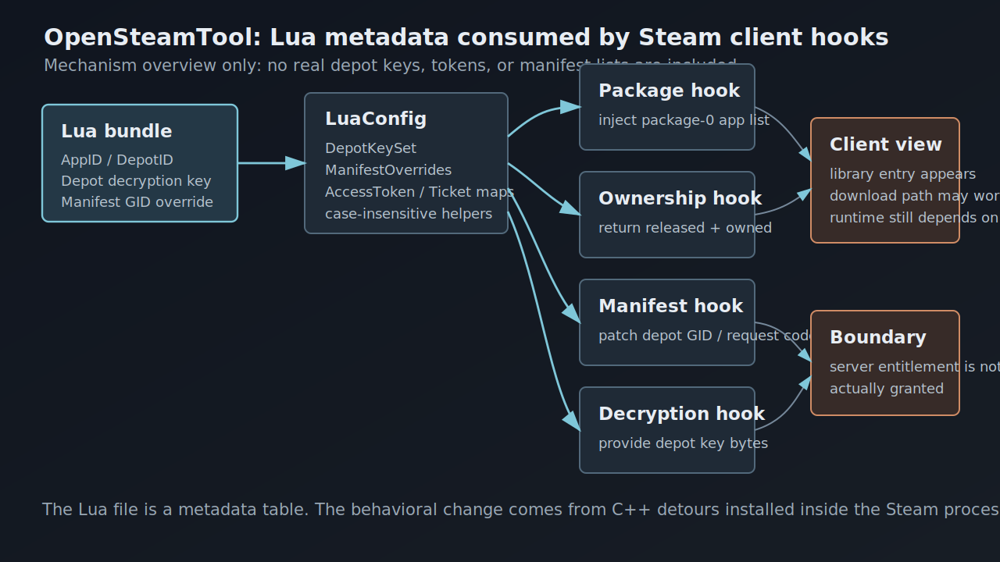
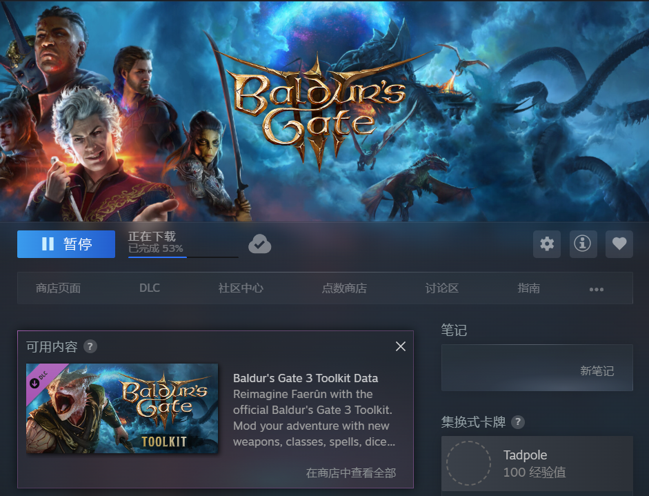

# OpenSteamTool Internals: How Lua Metadata Drives Steam Fake Library Entries

> This is a source-reading and client trust-boundary analysis. It does not publish real depot keys, access tokens, tickets, or reusable manifest lists, and it is not a guide for bypassing ownership checks. All Lua snippets below are structural examples.



## Abstract

OpenSteamTool is best understood as a configuration-driven client-state rewriting system. Lua files declare target AppIDs or DepotIDs, depot decryption keys, and manifest GID overrides. The C++ DLL then enters `steam.exe` and uses those declarations to patch Steam client's package, ownership, manifest, depot-key, IPC, and protobuf network paths.

The analyzed `1086940.lua` file is not an algorithm. It is a content metadata table. It has 108 lines, 55 `addappid` calls, 54 unique IDs, 53 `setManifestid` calls, and 54 strings shaped like 64-character depot keys. The first ID, `1086940`, is publicly associated with *Baldur's Gate 3* on the Steam store.

The crucial distinction is this:

```text
OpenSteamTool can rewrite local client facts.
It cannot create a real server-side Steam entitlement.
```

## Method and Evidence

This analysis cross-checks three sources.

The first source is the OpenSteamTool codebase:

| Area | File | Role |
| --- | --- | --- |
| Loader | `src/dllmain.cpp` | Loads `diversion.dll`, parses Lua, installs hooks |
| Lua runtime | `src/Utils/LuaConfig.cpp` | Defines `addappid`, `setManifestid`, ticket helpers, HTTP helpers |
| Hot reload | `src/Utils/FileWatcher.cpp` | Parses newly added Lua files and refreshes licenses |
| Package and ownership | `src/Hook/Hooks_Package.cpp` | Injects app IDs into package 0 and spoofs ownership |
| Manifest | `src/Hook/Hooks_Manifest.cpp` | Replaces depot manifest GIDs and fetches manifest request codes |
| Depot key | `src/Hook/Hooks_Decryption.cpp` | Supplies depot decryption key bytes |
| IPC | `src/Hook/Hooks_IPC*.cpp` | Patches selected Steam API responses |
| Network packets | `src/Hook/Hooks_NetPacket.cpp` | Rewrites selected protobuf requests and responses |
| Structures | `src/Steam/Structs.h` | Defines local views of Valve internal structures |

The second source is the project README, which explicitly lists unowned-game unlocks, DLC unlocks, Lua-loaded depot decryption keys, manifest request-code providers, access token support, and ticket support.

The third source is public Steamworks documentation. Steamworks describes depots as logical file groups delivered to customers, build manifests as file and metadata lists for depot builds, and authentication APIs as mechanisms for user identity and application ownership validation.

## Client-Side Scope

The phrase "fake library entry" should not be read as "the Steam account now owns the game." The real entitlement record is server-side. OpenSteamTool operates after Steam client has turned server and local metadata into in-memory structures.

The practical target is narrower:

```text
Make the local Steam client enter the same code path it would use
for an owned app, without changing Valve's server-side entitlement state.
```

That local illusion may affect the library UI, install button, depot selection, download flow, and some Steam API calls. It does not necessarily survive game backend checks, anti-cheat, Denuvo, encrypted app tickets, cloud permissions, multiplayer services, or server-side account checks.

## Steam Content Model

An **AppID** identifies a Steam application: a game, DLC, tool, demo, test app, or related object. `1086940` is the public Steam AppID for *Baldur's Gate 3*.

A **DepotID** identifies a content-delivery unit. A single game can use many depots for operating systems, languages, DLC, shared assets, tools, and branch-specific data. That is why a Lua file for one visible game can contain many IDs.

A **Manifest GID** identifies a concrete snapshot of a depot. A depot can have many manifests across builds and branches. The manifest answers "which files and chunks belong to this depot version?"

A **depot decryption key** lets the client decrypt encrypted depot content. It is not derivable from AppID, DepotID, or manifest GID. It is sensitive material normally issued only through authorized Steam content paths.

Tickets and tokens are a different layer. `AppTicket`, `ETicket`, PICS access tokens, and user-stat SteamIDs relate to runtime authorization, protected metadata, or Steam API behavior. The analyzed `1086940.lua` does not contain those fields.

## What `1086940.lua` Stores

The file is a declarative table, not a control program. It has no custom Lua functions, loops, or branches.

| Metric | Value |
| --- | ---: |
| Lines | 108 |
| `addappid(...)` calls | 55 |
| Unique IDs in `addappid` | 54 |
| `setManifestid(...)` calls | 53 |
| 64-character hex strings | 54 |
| Duplicated ID | `1086940` |

Its structure can be represented as:

```lua
addappid(APP_OR_DEPOT_ID)
addappid(APP_OR_DEPOT_ID, MODE_PLACEHOLDER, "DEPOT_KEY_AS_64_HEX")
setManifestid(DEPOT_ID, "MANIFEST_GID_AS_DECIMAL_STRING")
```

The second argument of `addappid` is often visually tempting, but the current source does not use it at all. It should not be interpreted as "App vs Depot type," "DLC flag," or "enabled flag." `lua_addappid` reads argument 1 as an unsigned 32-bit ID and argument 3 as the optional key. The key must be the third argument; `addappid(id, "key")` will not register the string as a depot key.

The duplicated `1086940` entry is also explainable from source. `lua_addappid` prefers a non-empty key over a previous empty value, so an initial ID-only declaration can later be enriched with a key-bearing declaration.

## Where the Lua Data Comes From

The fields in the Lua file do not have equal visibility.

| Data | Visibility | Plausible legitimate source | Risk when found in third-party lists |
| --- | --- | --- | --- |
| AppID | High | Store page, Steamworks backend, public APIs, databases | Usually not sensitive |
| DepotID | Medium | Steamworks, appinfo, owned-client metadata, public indexes | Not entitlement by itself |
| Manifest GID | Medium | SteamPipe builds, appinfo, manifest caches, branch metadata | May expose build or branch state |
| Manifest request code | Low | Authorized client request or provider | Permission-adjacent |
| Depot key | Very low | Authorized content-delivery path or Steamworks permission | Sensitive material |
| AppTicket / ETicket | Very low | Runtime Steam API or local registry cache | Identity and ownership sensitive |
| Access token | Very low | Protected metadata request path | Permission-adjacent |

This distinction matters. Source code proves how these fields are consumed; it does not prove the exact collection path used by the author of a particular Lua file. AppIDs and some depot metadata can be observed publicly. Depot keys cannot be computed from manifest IDs and should not be treated as ordinary metadata. If they appear in a third-party Lua list, they likely came from an authorized client cache, privileged account, sharing, leakage, or other unofficial distribution.

OpenSteamTool does not invent ownership. It consumes already collected metadata and answers local client questions with that data.

The screenshot below shows a common third-party aggregation pattern: entries are indexed by game name or AppID and expose Lua downloads for OpenSteamTool. It explains why many users encounter Lua files as ready-made lists. It does not prove that sensitive fields inside those lists came from a lawful or trustworthy source.


From the viewpoint of a site operator, this kind of service is more plausibly a list aggregator plus Lua template renderer than a system that derives keys from public data. A high-level model would look like this:

```text
public metadata index
  + user submissions / maintainer curation / mirrored lists / authorized exports
  + field validation and deduplication
  + Lua template rendering
  -> per-AppID Lua downloads
```

The layers have very different trust properties. The public metadata layer can be highly automated: store pages, public APIs, SteamDB-style indexes, or appinfo caches can provide AppIDs, names, covers, some DepotIDs, and some manifest relationships. The search box, AppID labels, cover grid, and download buttons in the screenshot all look like that kind of index.

The difficult part is sensitive material. Depot keys, manifest request codes, AppTickets, ETickets, and access tokens should not be treated as public data. If a site can provide many working Lua files, the core source is unlikely to be computation. More likely inputs include user-uploaded Lua files, maintainer-curated lists, mirrored community repositories, exports from authorized clients or Steamworks-permissioned environments, or unofficial sharing and leaks. Neither the OpenSteamTool source nor the Steam content model supports deriving a depot key from AppID, DepotID, and manifest GID alone.

The final Lua generation step is comparatively mechanical: write the main app as `addappid(main_appid)`, write keyed depots as `addappid(depotid, placeholder, key)`, write manifest bindings as `setManifestid(depotid, manifest_gid)`, and package the result as a `.lua` file for that AppID. In other words, the "download Lua" button does not necessarily hide complex reverse engineering. The hard problems are data provenance, consistency validation, and the compliance boundary around sensitive fields.

For technical analysis, these sites show how Lua lists circulate in the ecosystem. They should not be treated as authoritative sources. Once a Lua file contains real depot keys, it has crossed from ordinary metadata into permission-sensitive material.

## Loading and Hook Installation

OpenSteamTool ships proxy DLLs such as `dwmapi.dll` and `xinput1_4.dll`. They rely on Windows DLL search behavior so that `steam.exe` loads the local proxy first. The proxy then loads `OpenSteamTool.dll`; the XInput proxy also forwards real XInput exports to avoid breaking normal controller behavior.

`OpenSteamTool.dll` starts a worker thread. That thread:

1. Gets the Steam installation directory.
2. Copies `steamclient64.dll` to `bin\diversion.dll`.
3. Loads `diversion.dll`.
4. Reads `opensteamtool.toml`.
5. Parses Lua directories.
6. Starts the Lua file watcher.
7. Installs SteamUI and SteamClient hooks.

The `diversion.dll` copy is important. `Hooks_SteamUI.cpp` intercepts Steam's `LoadModuleWithPath` and returns the loaded `diversion.dll` module when Steam asks for `steamclient64.dll`. This gives OpenSteamTool a controlled hook surface.

## LuaConfig as the Data Plane

`LuaConfig.cpp` converts Lua calls into C++ maps. One implementation detail matters: `DepotKeySet` is used both as the set of IDs considered by ownership/package hooks and as the map from depot IDs to depot keys. This is an implementation-level ID mixing, not a clean model-level separation between AppID and DepotID.

| Lua API | Runtime storage | Consumer |
| --- | --- | --- |
| `addappid(id)` | `DepotKeySet[id] = ""` | package, ownership, IPC, network hooks |
| `addappid(id, _, key)` | `DepotKeySet[id] = key` | depot key hook |
| `setManifestid(depot, gid)` | `ManifestOverrides[depot] = { gid, 0 }` | manifest hook |
| `addtoken(app, token)` | `AccessTokenSet[app]` | PICS hook |
| `setAppTicket(app, hex)` | registry `AppTicket` | IPC ticket handlers |
| `setETicket(app, hex)` | registry `ETicket` | IPC ticket handlers |
| `setStat(app, steamid)` | `StatSteamIdSet[app]` | UserStats hooks |

Lua parsing is line-oriented: `ParseFile` accumulates text until `luaL_loadstring` says it is a complete statement, then executes it. This is why one declaration per line works naturally.

Function names are case-insensitive. C++ registers lowercase helpers and installs a `_G.__index` fallback that lowercases unresolved global names.

Hot reload only handles newly added `.lua` files. Deleting or editing an existing file does not revoke already injected state in the current Steam session.

## Package and Ownership Hooks

The first visible effect comes from `Hooks_Package.cpp`.

`LoadPackage` calls the original function, then, if `PackageId == 0`, appends all IDs from `LuaConfig::GetAllDepotIds()` into the package's `AppIdVec`. This means all keys from `DepotKeySet` are appended; the project does not distinguish main AppIDs, DLC AppIDs, and DepotIDs at this stage.

`CheckAppOwnership` is even more direct. If the original function succeeds and `pOwn->ExistInPackageNums > 1`, OpenSteamTool marks the app as truly owned and excludes it from spoofing. Otherwise, if the queried app is in `LuaConfig::HasDepot(appId)`, OpenSteamTool writes:

```cpp
pOwn->PackageId    = 0;
pOwn->ReleaseState = Released;
pOwn->GameIDType   = App;
return true;
```

This is the local library illusion. Steam client callers receive an ownership result that looks valid enough to proceed.

## Manifest and Download Path

Once the app looks owned, the install path still needs depot manifests.

`BuildDepotDependency` builds a vector of `DepotEntry` structures. OpenSteamTool walks that vector and, for matching depots, replaces `ManifestGid` with the value from `ManifestOverrides`.

`setManifestid(depot, gid)` therefore means:

```text
When Steam builds the depot list, use this manifest GID for this depot.
```

It does not mean "grant ownership" or "decrypt content." It selects a content snapshot. There is also an implementation/documentation mismatch here: the README shows an explicit size argument example, but the current `lua_setManifestid` implementation forces `size` to `0` even if a third argument is supplied.

Some protected manifests also need a manifest request code. OpenSteamTool handles `ContentServerDirectory.GetManifestRequestCode#1` at the protobuf packet layer. On request, it records the job ID and launches an async code lookup; on response, it injects the code and marks the result OK.

The provider order is:

1. Lua `fetch_manifest_code_ex(app, depot, gid)`.
2. Lua `fetch_manifest_code(gid)`.
3. The configured provider branch, where the code has both `SteamRun` and `Wudrm`.

The analyzed Lua file stores GIDs, not request codes. Codes are resolved at runtime.

There is another implementation/documentation mismatch: `Config.h` defaults `manifestUrl` to `Wudrm`, and `Config::Load` only explicitly handles the string `"wudrm"`. The `FetchSteamRun` branch exists, but the example `url = "steamrun"` is not explicitly parsed into `ManifestUrl::SteamRun` by the current code path.

## Depot Decryption Keys

`Hooks_Decryption.cpp` intercepts `LoadDepotDecryptionKey`. When Steam asks for a key name ending in `\<DepotId>\DecryptionKey`, OpenSteamTool extracts the depot ID and asks `LuaConfig::GetDecryptionKey(depotId)`.

If the Lua entry provided a non-empty 64-character key string, it is converted into 32 bytes and copied into Steam's buffer. The registration path checks length, not full hexadecimal validity; conversion happens later with base-16 parsing semantics.

This is why the key strings matter:

```text
Ownership makes the app look available.
Manifest GID chooses the depot snapshot.
Depot key makes encrypted depot content locally readable.
```

Missing any one of these can break the chain at a different stage.

## IPC and Protobuf Hooks

OpenSteamTool also patches runtime-facing Steam API behavior.

At the IPC layer, `IPCProcessMessage` dispatches selected `IClientUser` and `IClientUtils` calls. Handlers can patch `GetAppID`, `GetSteamID`, app ownership ticket data, and encrypted app ticket calls. These paths are relevant to SteamStub, Denuvo, or games that ask Steam APIs about identity and ownership.

The active ETicket path is primarily IPC-based. The old `Hooks_AppTicket::Install()` path is commented out in `HookManager.cpp`, and the network-packet `CMsgClientRequestEncryptedAppTicketResponse` branch is also commented as migrated to IPC. The IPC flow is: record `hAsyncCall -> appId` in `RequestEncryptedAppTicket`, write cached ticket bytes in `GetEncryptedAppTicket`, and patch `EncryptedAppTicketResponse_t` to OK when `GetAPICallResult` is queried.

At the protobuf network layer, `Hooks_NetPacket.cpp` intercepts outgoing and incoming frames. It handles PICS access tokens, user stats, manifest request codes, family sharing notifications, and online-fix metadata. This layer is conditional, not global: PICS injection only touches existing app entries that match both `HasDepot` and a configured access token; UserStats spoofing avoids requests with `sha_schema`, tracks job IDs, and has separate schema-version conditions for `ClientGetUserStats`. This layer is necessary because not every meaningful Steam result is a synchronous local function return; many are asynchronous service responses.

`1086940.lua` does not configure tickets or tokens, so its main role is library/download/decryption. The project as a whole is broader than that one file.

## End-to-End Chain for `1086940.lua`

The chain is:

1. Steam loads a proxy DLL.
2. The proxy loads `OpenSteamTool.dll`.
3. OpenSteamTool loads a hooked copy of `steamclient64.dll`.
4. Lua files are parsed.
5. `addappid` fills `DepotKeySet`.
6. `setManifestid` fills `ManifestOverrides`.
7. `LoadPackage` injects IDs into package 0.
8. `CheckAppOwnership` returns an owned/released result for configured IDs.
9. Steam UI and install logic see the app as locally available.
10. `BuildDepotDependency` replaces manifest GIDs for configured depots.
11. The manifest request-code hook patches protected manifest responses when needed.
12. `LoadDepotDecryptionKey` supplies key bytes from Lua.
13. IPC and network hooks patch selected runtime API behavior.

That is the technical meaning of "fake library entry" in this project.

The visible client-side result can look like an installable or downloading Steam library page. The screenshot below demonstrates that local path. It proves that the client state reached the install/download branch; it does not prove that the account has a real server-side entitlement.



## Building a Research Lua Without a Ready-Made File

If there is no ready-made Lua file, a usable file cannot be generated from nothing. OpenSteamTool's Lua is not a cracker or a discovery engine. It only serializes already known App, depot, manifest, key, token, or ticket material into a format consumed by the C++ hooks.

In an authorized research environment, the workflow is:

1. **Define the target boundary**: use an app you own, develop, or have explicit permission to test. A public AppID identifies the target but grants no content rights.
2. **Map AppID to depots**: use Steamworks, SteamPipe build output, authorized client metadata, or appinfo-style indexes to understand the main AppID, DLC AppIDs, platform depots, language depots, and shared depots.
3. **Select manifest snapshots**: choose a manifest GID for each depot that must participate in the download path. The GID is a depot-version selector, not an entitlement.
4. **Obtain authorized decryption material**: depot keys must come from a path allowed to access that depot. They are not derivable from manifest IDs and cannot be replaced by random 64-character strings.
5. **Identify extra gates**: protected manifests may need request codes; runtime paths may need AppTicket or ETicket data; protected metadata may need PICS access tokens.
6. **Write Lua according to source semantics**: the key must be the third `addappid` argument, and the current `setManifestid` implementation does not preserve the optional size argument.
7. **Validate consistency**: verify that every key belongs to the depot ID it is attached to, every manifest belongs to the selected depot and branch, and AppIDs and DepotIDs are not accidentally conflated even though OpenSteamTool stores them in the same internal map.

A structural, non-real example looks like this:

```lua
-- Main app: put it into the ownership candidate set.
addappid(1000000)

-- Content depot: the third argument is the authorized 32-byte key encoded as 64 chars.
-- The second argument is not used by the current OpenSteamTool source.
addappid(1000001, 1, "AUTHORIZED_DEPOT_KEY_64_HEX_PLACEHOLDER")
setManifestid(1000001, "1111111111111111111")

-- Optional DLC or additional depot, depending on appinfo and dependency metadata.
addappid(1000002, 1, "AUTHORIZED_EXTRA_DEPOT_KEY_64_HEX_PLACEHOLDER")
setManifestid(1000002, "3333333333333333333")

-- Protected manifest providers are intentionally left as non-operational placeholders.
function fetch_manifest_code_ex(appid, depotid, manifestid)
    return 0
end
```

The key placeholders above are intentionally not 64-character hex strings accepted by the current source; the manifest placeholders also do not correspond to real content. They describe shape, not reusable data. A working research sample requires correct ID relationships, manifest-to-depot matching, authorized depot keys, and lawful request-code, ticket, or token handling where those paths are needed. Otherwise the failure will show up as a visible-but-not-installable app, failed manifest retrieval, failed decryption, or runtime rejection by Steam API or the game's own backend.

## Limits and Failure Modes

The design is powerful but fragile.

It depends on byte signatures in `Patterns.h`. Steam client updates can move or rewrite internal functions.

It depends on local definitions of Valve internal structures such as `PackageInfo`, `AppOwnership`, `DepotEntry`, and `CUtlBuffer`. These layouts are not stable public ABI.

It is additive within a session. Newly added Lua files can refresh state, but removing or editing existing files does not cleanly revoke prior injections.

It is incomplete against server-side checks. Game backend authorization, multiplayer services, anti-cheat, cloud saves, Denuvo, encrypted tickets, and account risk systems may still reject the session.

It involves sensitive materials. Depot keys, tickets, and access tokens should not be redistributed as if they were ordinary configuration.

## Conclusion

`1086940.lua` stores content metadata, not executable bypass logic. It declares which IDs should be treated as relevant, which manifest snapshots should be selected, and which depot keys should be returned when Steam asks for them. OpenSteamTool's C++ layer turns those declarations into local Steam client behavior by patching package, ownership, manifest, decryption, IPC, and protobuf paths.

The broader lesson is about client trust boundaries. A rich desktop client must cache and transform server facts into local structures. If an in-process actor can modify those structures before they are consumed, the client can be made to believe a different local reality. Strong authorization must therefore close the loop at the server, ticket, key-distribution, and runtime-verification layers.

This article is for technical discussion, source reading, and client trust-boundary research only. It should not be used to bypass purchases, authorization, or platform rules. Steam and OpenSteamTool both change over time; if any source interpretation or terminology here is wrong, corrections are welcome.

## References

- [OpenSteamTool README](https://github.com/OpenSteam001/OpenSteamTool)
- [Steamworks Documentation: Applications / Depots](https://partner.steamgames.com/doc/store/application/depots)
- [Steamworks Documentation: Builds and Manifests](https://partner.steamgames.com/doc/store/application/builds)
- [Steamworks Documentation: User Authentication and Ownership](https://partner.steamgames.com/doc/features/auth)
- [Steamworks Documentation: Uploading to Steam](https://partner.steamgames.com/doc/sdk/uploading)
- [Steam Store: Baldur's Gate 3, AppID 1086940](https://store.steampowered.com/app/1086940/Baldurs_Gate_3/)
