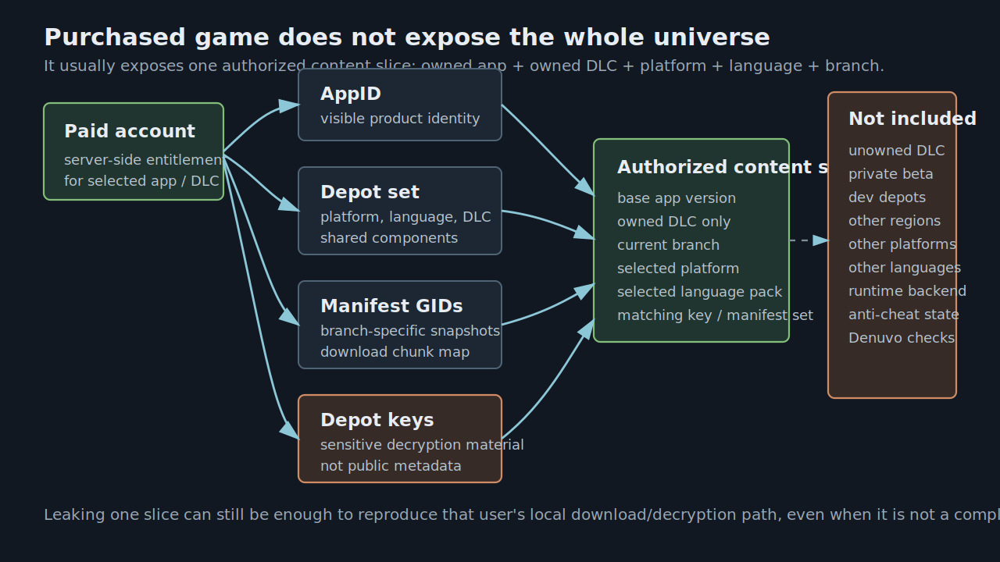
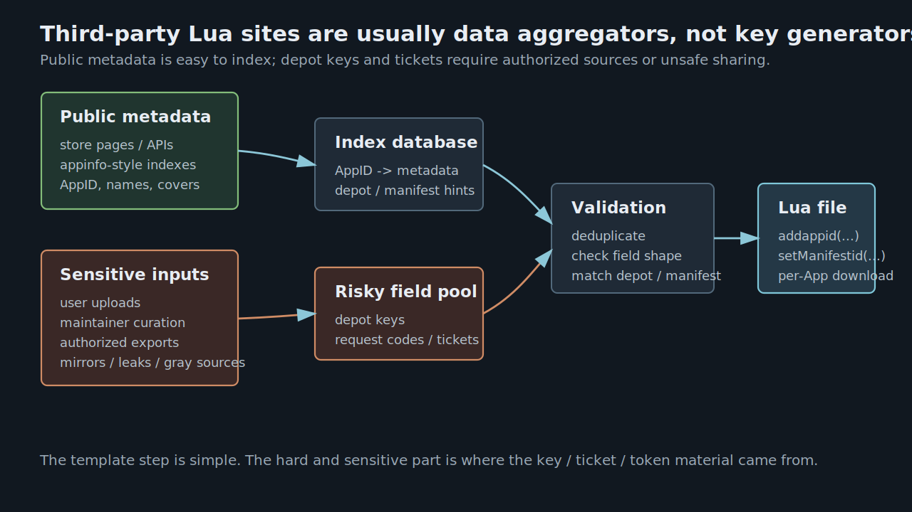
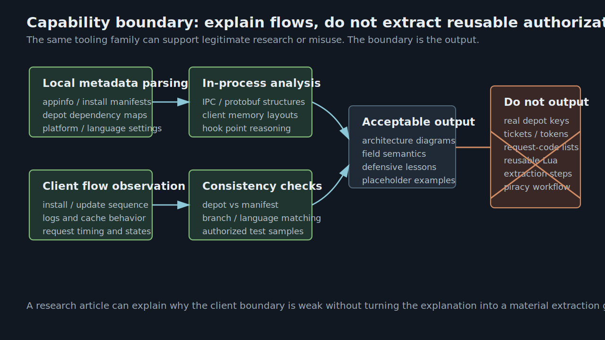

# OpenSteamTool 技术原理解析：Lua 配置如何参与 Steam 假入库

> 本文是源码阅读与客户端安全边界分析，不发布真实 depot key、access token、ticket、manifest 清单，也不提供复现绕过授权的操作步骤。文中所有 Lua 片段均为结构化伪例。Steam 客户端侧状态可以被改写，不等于服务端授权真实存在。


## 摘要

OpenSteamTool 的“假入库”可以被概括为一个配置驱动的客户端状态改写系统：Lua 文件声明目标 AppID / DepotID、depot decryption key、manifest GID 等内容元数据；C++ DLL 进入 `steam.exe` 后，把这些元数据注入 Steam 客户端内部的 package、ownership、manifest、decryption key、IPC 和 protobuf 网络包路径。最终效果是客户端局部认为某些未真实购买的 App 已拥有，进而显示在库中、进入安装路径，甚至在部分 Steam API 调用上返回更接近“正常拥有”的结果。

这套机制的关键不在 Lua 语法，而在两个事实：

1. Steam 客户端为了展示库、安装内容和启动游戏，会在本地维护大量授权相关缓存和中间结构。
2. 这些中间结构在被 UI、下载器和游戏进程消费之前，可以被进程内 hook 改写。

`1086940.lua` 是一个很典型的配置样本。它共 108 行，包含 55 次 `addappid` 调用、54 个唯一 ID、53 次 `setManifestid` 调用，以及 54 个 64 字符十六进制字符串。公开商店页显示 `1086940` 是 *Baldur's Gate 3* 的 AppID。该文件的主体不是算法，而是一张内容分发元数据表：哪些 ID 要被客户端当作“可拥有对象”，哪些 depot 要使用哪个 manifest，哪些 depot 在本地解密时使用哪份 key。

## 研究范围与证据来源

本次分析基于三类证据交叉验证。

第一类是 OpenSteamTool 本地源码。重点文件包括：

| 模块 | 关键文件 | 分析用途 |
| --- | --- | --- |
| 加载入口 | `src/dllmain.cpp` | 进入 Steam 进程、加载 `diversion.dll`、扫描 Lua、安装 hook |
| Lua 解析 | `src/Utils/LuaConfig.cpp` | `addappid`、`setManifestid`、`setAppTicket` 等 Lua API 的真实语义 |
| 热加载 | `src/Utils/FileWatcher.cpp` | 新增 Lua 文件如何触发重新解析和 license refresh |
| 包与所有权 | `src/Hook/Hooks_Package.cpp` | 假入库最核心的 package 注入和 ownership 伪造 |
| manifest | `src/Hook/Hooks_Manifest.cpp` | depot manifest GID 覆盖和 request code provider |
| depot key | `src/Hook/Hooks_Decryption.cpp` | depot decryption key 的本地提供路径 |
| IPC | `src/Hook/Hooks_IPC*.cpp` | Steam API 返回值和 ticket 相关回包的改写 |
| 网络包 | `src/Hook/Hooks_NetPacket.cpp` | PICS、manifest request code、stats、family sharing 等 protobuf 包处理 |
| 内部结构 | `src/Steam/Structs.h` | `PackageInfo`、`AppOwnership`、`DepotEntry`、`CUtlBuffer` 等结构布局 |

第二类是项目公开文档。OpenSteamTool README 明确列出核心能力：解锁未拥有游戏、解锁 DLC、从 Lua 自动加载 depot decryption key、通过上游 API 或 Lua 函数下载 manifest request code、支持 AppTicket / ETicket 等。

第三类是 Steamworks 公开文档。Steamworks 对 depot 的定义是“作为一个整体交付给客户的一组文件”；build 文档说明 manifest 是 depot build 中所有文件及其元数据的清单；认证文档说明 Steamworks 提供多种用户身份和应用所有权验证方式，包括 session ticket 与 encrypted application ticket。这些公开定义可以帮助区分 AppID、DepotID、manifest、key、ticket 的语义边界。

## 威胁模型：它改写的是客户端事实，不是服务端账本

讨论 OpenSteamTool 时，最容易混淆的是“看起来拥有”和“真实拥有”。

Steam 账号是否拥有某个 App，最终是服务端授权事实。它涉及购买、兑换、家庭共享、开发者权限、测试分支、包授权等后台状态。OpenSteamTool 不可能通过本地 Lua 文件给 Valve 服务端写入一条购买记录。

OpenSteamTool 影响的是客户端视图：当 `steam.exe` 内部某个函数或网络回包被消费时，hook 层把结果改成“像是拥有”。这种改写足以影响库 UI、安装按钮、部分下载路径和部分 Steam API 返回值；但只要后续流程依赖服务端实时验证、游戏自建后端、反作弊、云存档权限、多人在线许可或 Denuvo 授权，它就可能被再次拦截。

因此，本文把“假入库”定义为：

```text
在不改变账号服务端授权状态的前提下，
通过改写 Steam 客户端本地 package / ownership / content metadata / API response，
让客户端局部进入“目标 App 已拥有”的执行路径。
```

这个定义很重要，因为它解释了为什么 Lua 里需要的不止 AppID。只有 AppID，最多能让 UI 尝试显示一个对象；要让下载路径继续走，还需要 depot、manifest、request code、depot key；要让运行时继续走，还可能需要 ticket、SteamID、stats schema、游戏自己的后端状态。

## Steam 内容分发模型

### AppID：产品和运行时身份

AppID 是 Steam 应用的核心标识。商店页、Steamworks 后台、Steam API、游戏进程中的 `GetAppID` 都围绕它组织。一个 AppID 可以代表游戏本体、工具、DLC、demo、test app 或其他应用对象。

在 `1086940.lua` 中，首行 `addappid(1086940)` 的意义是声明主 AppID 参与 OpenSteamTool 的所有权伪造集合。公开商店页显示 `1086940` 对应 *Baldur's Gate 3*。后续 ID 是否都是 depot、DLC 或相关内容对象，需要结合 Steam appinfo / depot metadata 判断；源码层面 OpenSteamTool 并不严格区分“AppID”和“DepotID”，而是把它们统一放进 `DepotKeySet`，在不同 hook 点按上下文解释。

### DepotID：下载和挂载单位

Depot 是 SteamPipe 内容分发的基本单位。Steamworks 文档把 depot 描述为“一组作为整体交付给客户的文件”。一个游戏可能有多个 depot：Windows / Linux / macOS 可执行文件、不同语言资源、高清材质、DLC、工具、共享组件等都可能被拆开。

这就是为什么 `1086940.lua` 不是只写一个 `1086940`。库里出现一个 App 只是第一步；安装时 Steam 需要知道这个 App 应该下载哪些 depot。

### Manifest GID：depot 的具体版本快照

Manifest 是 depot build 的文件清单。Steamworks build 文档说明，manifest 包含 depot build 中所有文件及其元数据，例如文件大小、SHA1 hash 和 flags。每次 depot 内容变化，都可能生成新的 manifest。

`setManifestid(depot, gid)` 绑定的是“某个 depot 使用哪一个 manifest GID”。它不是授权信息，而是版本选择信息。没有 manifest，客户端不知道要下载哪批 chunk；manifest 不匹配，下载内容可能和期望 build 不一致。

### Depot decryption key：内容解密材料

Depot key 是下载后解密 depot 内容的材料。它不能从 AppID、DepotID 或 manifest GID 推导出来，也不是把 manifest 做哈希得到的值。它属于权限敏感数据：合法客户端或 Steamworks 权限方在内容分发流程中才应获得。

这解释了 `1086940.lua` 中大量 64 字符 hex 字符串的作用。64 个十六进制字符等于 32 字节，源码会把它转成 byte vector，并在 Steam 请求 `DecryptionKey` 时返回给客户端。

### Ticket 与 access token：运行时和受保护 metadata 的额外门槛

Steamworks 认证文档把用户身份和应用所有权验证分成多种路径，包括 session ticket、encrypted application ticket、Web API 等。OpenSteamTool 也支持 `setAppTicket`、`setETicket`、`addtoken`、`setStat`，但 `1086940.lua` 没有使用这些字段。

这说明该 Lua 样本主要覆盖的是“库可见 + 内容下载 + depot 解密”链路，而不是完整覆盖所有 DRM、游戏后端、多人联机和加密票据路径。



## `1086940.lua` 的结构化画像

这份 Lua 文件是纯声明式配置，只有顶层函数调用。

| 指标 | 结果 |
| --- | ---: |
| 总行数 | 108 |
| `addappid(...)` 调用 | 55 |
| 唯一 `addappid` ID | 54 |
| `setManifestid(...)` 调用 | 53 |
| 64 字符 hex key | 54 |
| 重复登记的 ID | `1086940` |
| 自定义 Lua 函数 | 0 |
| `addtoken` / `setAppTicket` / `setETicket` | 0 |

抽象结构如下：

```lua
addappid(APP_OR_DEPOT_ID)
addappid(APP_OR_DEPOT_ID, MODE_PLACEHOLDER, "DEPOT_KEY_AS_64_HEX")
setManifestid(DEPOT_ID, "MANIFEST_GID_AS_DECIMAL_STRING")
```

关键点有三个。

第一，`addappid` 第一个参数会被源码转成 `uint32_t`，作为 AppID 或 DepotID 使用。

第二，`addappid` 第三个参数如果是长度为 64 的字符串，就被保存为 depot key。源码在写入时只校验长度，不校验每个字符确实是十六进制；后续 `GetDecryptionKey` 会按两个字符一组用 base16 转 byte。因此更严谨的说法是“长度为 64 的 key 字符串”，而不是源码已经验证过的“合法 64 字符十六进制 key”。

第三，`addappid` 第二个参数在当前源码中完全没有参与逻辑。它不能解释为“App / Depot 类型”“是否 DLC”“是否启用”等语义。README 示例仍保留了第二参数，可能是历史兼容、语义占位或旧版本遗留。当前 `lua_addappid` 只读取第 1 个和第 3 个参数；也就是说，key 必须放在第 3 个参数，`addappid(id, "key")` 这种二参数形式不会按 key 生效。

`1086940` 被调用两次也有解释：第一次只登记 ID，第二次带 key。`lua_addappid` 的策略是“非空 key 优先于已有空 key”，所以后一次调用会补全 key，不会被第一次空值阻塞。

## Lua 文件内信息从何而来

这是理解假入库最关键的一节。Lua 中的信息不是 OpenSteamTool 算出来的，而是外部收集后写入的内容分发元数据。不同字段的来源、敏感性和合法边界完全不同。

| 信息 | 可见性 | 典型合法来源 | 在第三方清单中的风险判断 |
| --- | --- | --- | --- |
| AppID | 高 | Steam 商店页、Steamworks 后台、Steam API、公开数据库 | 通常不敏感 |
| DepotID | 中 | Steamworks 后台、appinfo、SteamDB 等索引、已拥有 App 的本地 metadata | 单独 ID 不等于内容权限 |
| Manifest GID | 中 | Steamworks build 页面、SteamPipe 输出、公开分支索引、已拥有 App 的 manifest 缓存 | 可能涉及版本和分支信息 |
| Manifest request code | 低 | 授权客户端请求、特定 provider、受保护 manifest 查询路径 | 明显权限相关 |
| Depot key | 很低 | Steamworks 权限方、授权客户端内容分发流程 | 高敏感，不应公开传播 |
| AppTicket / ETicket | 很低 | 当前用户授权运行时、Steam API / 注册表缓存 | 高敏感，和身份/所有权验证相关 |
| Access token | 很低 | PICS 等受保护 metadata 请求路径 | 权限相关 |

源码只能证明这些字段如何被消费，不能直接证明这份 `1086940.lua` 的采集者具体从哪个站点、缓存或账号环境拿到了每个字段。因此下面是基于 Steam 内容生态的来源分层，而不是对该文件实际来源的断言。可以确定的是：这些值不是 OpenSteamTool 在运行时从空白状态计算出来的，而是外部收集后写入 Lua，再被 C++ hook 消费。

1. AppID 可从公开商店页直接确认。
2. DepotID 和 manifest GID 可来自 appinfo、SteamDB 等索引、SteamPipe / Steamworks build 数据或授权客户端缓存。
3. Depot key 只能来自有权访问内容的路径，或来自非官方共享、提取、泄露。它不是公开 metadata，也不是可推导值。
4. 若需要 protected manifest，还要额外解析 request code。OpenSteamTool 没把 request code 固化在该 Lua 文件中，而是在运行时通过 provider 或 Lua HTTP helper 查询。

这也是为什么本文不复述真实 key 和 manifest 清单。技术分析需要解释字段语义和消费路径，而不是传播可复用敏感材料。

下图展示的是一类第三方聚合站点的典型形态：按游戏名或 AppID 索引条目，并提供面向 OpenSteamTool 的 Lua 下载入口。它能解释为什么许多用户看到的 Lua 文件像“现成清单”，但不能证明清单内敏感字段的合法来源。对研究者而言，这类页面更适合作为生态现象截图，而不是可信数据源。


如果把自己放在这类站点的维护者视角，它的后端更像“清单聚合器 + Lua 模板生成器”，而不是一个能从公开信息自动推导 key 的服务。一个合理的高层模型如下：

```text
公开 metadata 索引
  + 用户投稿 / 维护者整理 / 其他清单同步 / 授权环境导出
  + 字段格式校验与去重
  + Lua 模板渲染
  -> 按 AppID 提供下载
```

其中每一层的可信度不同。公开 metadata 层可以自动化程度较高：站点可以用商店页、公开 API、SteamDB 类索引或 appinfo 缓存建立 AppID、名称、封面、部分 DepotID、部分 manifest 关系。截图中的列表、搜索框、AppID 标签和下载按钮，都更像这类索引系统的表现。



真正困难的是敏感字段。`depot key`、`manifest request code`、`AppTicket`、`ETicket`、`access token` 这类材料不应被视为公开数据。站点如果能批量提供“可用 Lua”，核心来源大概率不是计算，而是外部汇入：用户上传现成 Lua、维护者手工整理、从其他同类仓库同步、从已授权客户端或 Steamworks 权限环境导出，或者来自非官方共享与泄露。源码和 Steam 内容模型都不支持“只凭 AppID / DepotID / manifest GID 算出 depot key”。

站点生成 Lua 时的机械部分反而很简单：主 App 写成 `addappid(main_appid)`；带 key 的 depot 写成 `addappid(depotid, 占位参数, key)`；manifest 关系写成 `setManifestid(depotid, manifest_gid)`；最后按 AppID 打包成一个 `.lua` 文件。也就是说，网页的“下载 Lua”按钮背后未必有复杂逆向逻辑，复杂性主要转移到了数据来源、字段一致性校验和敏感材料的合规边界上。

因此这类站点在技术分析中只能说明生态如何分发清单，不能被当作权威来源。尤其是当 Lua 文件包含真实 depot key 时，它已经越过了普通 metadata 的边界；研究者应当把它看成权限敏感样本，而不是“公开爬取即可得到”的普通配置。

还可以再进一步理解这个风险：普通付费用户虽然通常拿不齐某个游戏的“全量宇宙”，但他可能拿到足够复现自己授权内容切片的数据。所谓内容切片，指的是该用户当时实际可访问的本体、已拥有 DLC、平台 depot、语言包、当前分支和对应 manifest。客户端为了把这些内容下载到本地并完成解密，必然会接触到与这组内容相匹配的下载元数据和解密材料。

如果这组材料被整理成 OpenSteamTool 可消费的 Lua，另一个没有相同授权的客户端就可能被推进到相似的本地路径：库里显示目标 App，安装流程选中相同 depot 和 manifest，下载到与付费用户本地版本一致或接近一致的内容，并在本地完成 depot 解密。换句话说，泄露的不只是“游戏 ID 列表”，而是足以复刻某个已授权用户内容版本的客户端侧材料。

这也是这类 Lua 清单真正敏感的地方。它未必覆盖所有 DLC、所有语言、所有平台、所有历史版本或所有运行时校验；但只要覆盖了某个付费用户实际下载过的一组 depot / manifest / key，就可能足以让其他人盗版入库并体验同一内容切片。后续是否能启动、联网、过反作弊、通过 Denuvo 或游戏自建后端，则取决于该游戏是否继续做服务端和运行时授权校验。

## OpenSteamTool 的进程注入和模块替换

OpenSteamTool 不是 Steam 插件，也不是 Steamworks SDK 应用。它是 Windows DLL 项目。

项目输出三个关键 DLL：

```text
dwmapi.dll
xinput1_4.dll
OpenSteamTool.dll
```

`dwmapi.dll` 和 `xinput1_4.dll` 是代理 DLL。它们利用 Windows DLL 搜索顺序，让 Steam 启动时优先加载当前目录下的同名 DLL，再由代理 DLL 加载真正的 `OpenSteamTool.dll`。`xinput1_4.dll` 还会转发真实 XInput API，避免破坏 Steam 正常调用。

`OpenSteamTool.dll` 进入 `steam.exe` 后，核心初始化在工作线程里完成，而不是直接塞进 `DllMain`。这是正确的工程选择：文件 IO、`LoadLibrary`、Detours transaction、内存扫描都不应该在 loader lock 下做。

初始化路径可以抽象为：

```text
Proxy DLL loaded by steam.exe
  -> LoadLibrary("OpenSteamTool.dll")
  -> InitThread
  -> copy steamclient64.dll to bin/diversion.dll
  -> LoadLibrary(diversion.dll)
  -> read opensteamtool.toml
  -> parse Lua directories
  -> start FileWatcher
  -> install SteamUI and SteamClient hooks
```

`diversion.dll` 是一个关键设计。OpenSteamTool 复制原始 `steamclient64.dll` 到 `bin\diversion.dll`，再对这个副本安装 hook。`Hooks_SteamUI.cpp` hook `LoadModuleWithPath`，当 Steam UI 请求 `steamclient64.dll` 时，把返回模块替换成 `diversion_hMdoule`。这样后续 Steam client 调用会进入被 OpenSteamTool 改写过的模块。

## LuaConfig：从配置文本到运行时数据结构

`LuaConfig.cpp` 是理解 `1086940.lua` 的入口。一个容易忽略的实现细节是：OpenSteamTool 用同一个 `DepotKeySet` 同时承载“所有权候选 ID 集合”和“depot key 映射”。这不是严格的 Steam 模型分层，而是项目内部的简化数据结构：同一个 ID 在 package / ownership hook 中被当作 AppID 候选，在 decryption hook 中又可能被当作 DepotID 查询 key。

它维护几组核心容器：

```cpp
DepotKeySet        // AppId_t -> string key
AccessTokenSet     // AppId_t -> uint64 token
ManifestOverrides  // depot id -> { gid, size }
StatSteamIdSet     // app id -> steamid
OwnedAppIdSet      // real-owned app ids, excluded from spoofing
```

Lua API 与容器的关系如下：

| Lua API | 读取参数 | 写入位置 | 后续消费者 |
| --- | --- | --- | --- |
| `addappid(id)` | `id` | `DepotKeySet[id] = ""` | package / ownership / IPC / netpacket |
| `addappid(id, _, key)` | `id`, `key` | `DepotKeySet[id] = key` | decryption hook |
| `setManifestid(depot, gid)` | `depot`, `gid` | `ManifestOverrides[depot] = { gid, 0 }` | manifest hook |
| `addtoken(app, token)` | `app`, `token` | `AccessTokenSet[app]` | PICS request hook |
| `setAppTicket(app, hex)` | `app`, `hex` | registry `AppTicket` | IPC ticket handlers |
| `setETicket(app, hex)` | `app`, `hex` | registry `ETicket` | IPC / ETicket handlers |
| `setStat(app, steamid)` | `app`, `steamid` | `StatSteamIdSet[app]` | UserStats hooks |

`ParseFile` 的执行方式也值得注意。它逐行累积文本，用 `luaL_loadstring` 判断是否构成完整语句，成功后立即执行。这使得 Lua 文件可以写成“一行一个配置调用”的清单形式。

大小写不敏感是通过 `_G.__index` 实现的。当 Lua 查找 `setManifestid` 失败时，C++ 会把名称转小写，到注册函数表中找到 `setmanifestid`。

热加载只监听新增 `.lua` 文件。新增文件被解析后，`FileWatcher` 会调用 `Hooks_Misc::NotifyLicenseChanged()`，把新 ID 插入 package 0 并触发 Steam 处理 license update。删除或修改旧 Lua 不会撤销当前会话里的注入状态。

## Package hook：让目标 ID 进入客户端许可证集合

假入库的第一层是 package 伪造。

Steam 客户端内部的 `PackageInfo` 包含 `AppIdVec`，也就是某个 package 对应的 AppID 列表。`Hooks_Package.cpp` hook `LoadPackage`，在原始函数执行后检查：

```cpp
if (pInfo->PackageId == 0) {
    appIds = LuaConfig::GetAllDepotIds();
    grow pInfo->AppIdVec;
    append appIds;
}
```

这里的 package 0 是 OpenSteamTool 选择的承载点。它把 Lua 中的所有目标 ID 都附加到 package 0 的 `AppIdVec` 里，使客户端的 package 数据结构包含这些原本不属于账号的 ID。注意这里追加的是 `DepotKeySet` 中的所有 key；项目没有在这个阶段区分主 AppID、DLC AppID 或 DepotID。这种 ID 混用是 OpenSteamTool 的实现选择，也是为什么文章不能把 Lua 中每个 ID 都武断称为严格意义上的 Steam AppID。

仅靠这一步还不够。因为 Steam 后续会对具体 AppID 做 ownership 检查；如果 ownership 仍然失败，库 UI 或安装路径仍可能中断。

## Ownership hook：把“是否拥有”改成真

`CheckAppOwnership` 是整个假入库链路中最关键的函数之一。

OpenSteamTool 先调用原始函数，再判断目标 AppID 是否在 `LuaConfig::HasDepot(appId)` 中。`HasDepot` 的定义不是简单查询 `DepotKeySet`，它还排除了 `OwnedAppIdSet`：

```cpp
return DepotKeySet.count(appId) && !OwnedAppIdSet.count(appId);
```

这说明项目刻意避免覆盖真实拥有的 App。如果原始 ownership 返回成功且 `ExistInPackageNums > 1`，OpenSteamTool 会把它记入 `OwnedAppIdSet`，后续不再伪造。

源码对“实际拥有”的判断也不是简单的 `result == true`。只有当原函数返回成功，并且 `pOwn->ExistInPackageNums > 1` 时，OpenSteamTool 才会调用 `MarkOwned(appId)`，后续不再伪造。这个条件比“原函数返回 true”更窄，说明项目只在较明确的真实包归属场景下把 App 标记为已拥有。否则它会改写 `AppOwnership`：

```cpp
pOwn->PackageId    = 0;
pOwn->ReleaseState = Released;
pOwn->GameIDType   = App;
return true;
```

从客户端调用者视角看，这个 App 现在来自 package 0，处于 released 状态，并且 ownership check 成功。库页面、安装按钮、部分 Steam API 都可能因此进入“已拥有”路径。

这就是“假入库”的最小闭环：

```text
LuaConfig 声明 ID
  -> LoadPackage 把 ID 放进 package
  -> CheckAppOwnership 对 ID 返回 true
  -> 客户端局部相信 App 可用
```

## Manifest hook：让下载路径指向指定 depot 快照

当客户端认为 App 可安装后，它需要知道具体下载哪些 depot，以及每个 depot 下载哪个 manifest。

`Hooks_Manifest.cpp` hook `BuildDepotDependency`。原始函数会构造 `DepotEntry` 列表，每个条目大致包含：

```cpp
DepotId
AppId
ManifestGid
ManifestSize
DlcAppId
...
```

OpenSteamTool 在原始函数返回后遍历 `pDepotInfo`，如果某个 `DepotId` 存在于 `ManifestOverrides`，就把该条目的 `ManifestGid` 替换为 Lua 中指定的 GID。

`setManifestid(depot, gid)` 的作用就在这里体现：

```text
它不是所有权声明；
它不是解密 key；
它是下载版本选择。
```

为什么要指定 manifest？因为 Steam 默认构造出来的 manifest 可能是当前分支最新版本，也可能因为假入库状态不完整而无法得到目标版本。Lua 中固定 GID 可以把下载路径钉在某个已知 depot 快照上。

源码还显示，`setManifestid` 的第三个 size 参数即使传入也会被忽略，当前实现强制 size 为 0。hook 时如果 override size 为 0，就保留原始 `ManifestSize`，避免错误大小破坏 Steam 下载显示或内部判断。这里和 README 存在一个实现层面的不一致：README 给出了“显式传入 size”的示例，但当前 `lua_setManifestid` 并不会保存该 size。

## Manifest request code：GID 之外的下载门槛

Manifest GID 并不总是足够。部分 manifest 下载需要 request code。OpenSteamTool 在 `Hooks_NetPacket.cpp` 中处理 `ContentServerDirectory.GetManifestRequestCode#1`。

这一段设计很有代表性：

1. 发送请求时，解析 protobuf body，取出 `depot_id`、`manifest_id` 和可选 `app_id`。
2. 如果 `depot_id` 不在 Lua 配置里，直接放行。
3. 如果命中 Lua 配置，则记录 `jobid_source`，并异步查询 manifest request code。
4. 收到 `ServiceMethodResponse` 时，按 `jobid_target` 找回异步查询结果。
5. 如果拿到非零 code，就改写 response：header 里 `eresult = OK`，body 里写入 `manifest_request_code`。

request code 的 provider 有三层：

| 优先级 | 来源 | 说明 |
| --- | --- | --- |
| 1 | Lua `fetch_manifest_code_ex(app, depot, gid)` | 最精确，能根据 app/depot/gid 构造自定义 API |
| 2 | Lua `fetch_manifest_code(gid)` | 只按 manifest GID 查询 |
| 3 | `opensteamtool.toml` 中配置的 provider | 代码中支持 `SteamRun` 与 `Wudrm` 两个分支 |

这解释了为什么 `1086940.lua` 里没有 request code：它只保存固定 manifest GID；request code 被设计成运行时查询项。

不过当前源码和文档在默认 provider 上也有差异。`Config.h` 中 `manifestUrl` 的默认值是 `Wudrm`；`Config::Load` 只在配置值为 `"wudrm"` 时显式赋值，没有把 `"steamrun"` 显式解析为 `ManifestUrl::SteamRun`。`Hooks_Manifest.cpp` 中确实有 `FetchSteamRun` 分支，但按当前配置解析路径，README / example 中的 `url = "steamrun"` 并不会把默认值从 `Wudrm` 切到 `SteamRun`。这类细节说明 OpenSteamTool 仍是快速演进中的逆向工程项目，文档和实现不一定完全同步。

## Decryption hook：把 64 字符 key 变成解密字节

`Hooks_Decryption.cpp` hook `LoadDepotDecryptionKey`。Steam 请求 key 时会传入类似 `...\<DepotId>\DecryptionKey` 的 key name。OpenSteamTool 从字符串中解析 depot ID，然后查询：

```cpp
LuaConfig::GetDecryptionKey(depotId)
```

`GetDecryptionKey` 从 `DepotKeySet` 取出字符串，按两个字符一组用 base16 转成 byte vector。如果 key 非空且 buffer 足够，就把字节复制给 Steam，并返回 key 长度。由于写入阶段只校验长度，错误字符会在 `strtoul(..., 16)` 转换语义下被处理，而不是被 Lua 解析阶段明确拒绝。

这一步是 `1086940.lua` 中 64 字符 hex 的直接用途。

可以把下载链路总结成：

```text
Ownership hook 让客户端相信可以安装
Manifest hook 决定下载哪个 depot 快照
Manifest request code hook 补齐受保护 manifest 的请求码
Decryption hook 提供 depot 内容解密材料
```

如果只有 ownership，没有 manifest，下载可能不知道版本；如果只有 manifest，没有 key，下载后可能无法解密；如果有 manifest GID 但缺 request code，受保护 manifest 仍可能拿不到。

## IPC hook：影响游戏进程看到的 Steam API

假入库如果只停在库 UI，游戏运行时很快会遇到 Steam API。OpenSteamTool 因此 hook 了 Steam IPC。

`Hooks_IPC.cpp` 拦截 `IPCProcessMessage`，解析 IPC header，按 interface ID 和 function hash 分发。它有一个重要限制：只对当前 AppID 命中 Lua 配置的进程运行 handler。这避免 Steam 自身 IPC 或其他游戏被过度污染。

几个 handler 值得关注。

**`IClientUtils::GetAppID`**  
在 `-onlinefix` 逻辑中，OpenSteamTool 可能把启动 GameID 改成 480；这个 handler 会把 Steam API 返回值修正回真实 AppID。

**`IClientUser::GetSteamID`**  
项目会尝试从注册表 `SteamID` 字符串或 cached AppOwnershipTicket 中解析 SteamID，然后写回 IPC response。README 里提到，这和 Denuvo / SteamStub 场景有关。

**`GetAppOwnershipTicketExtendedData` / `GetEncryptedAppTicket`**  
项目从注册表读取 `AppTicket` 和 `ETicket`，然后主要通过 IPC 路径改写 Steam API response 或 async callback，使游戏进程拿到缓存 ticket。需要注意：`HookManager.cpp` 中旧的 `Hooks_AppTicket::Install()` 目前被注释，`Hooks_NetPacket.cpp` 里的 `CMsgClientRequestEncryptedAppTicketResponse` 分支也标注为迁移到 IPC 层并被注释。因此当前活跃路径主要是 IPC，而不是旧的 registry config hook 或网络 ETicket response hook。

ETicket 的 IPC 链路可以拆成三步：

1. `IClientUser::RequestEncryptedAppTicket` 返回 async call 句柄时，OpenSteamTool 记录 `hAsyncCall -> appId`。
2. `IClientUser::GetEncryptedAppTicket` 被调用时，如果注册表有 `ETicket`，就把 ticket 写进 response buffer。
3. `IClientUtils::GetAPICallResult` 查询 `EncryptedAppTicketResponse_t` 时，OpenSteamTool 根据 async call 映射把 callback result 改成 `k_EResultOK`。

`1086940.lua` 没有写入 ticket，所以这些 handler 在该样本中的作用有限；但它们说明 OpenSteamTool 的设计目标不止是“显示到库里”，而是尽量覆盖游戏运行时会碰到的 Steam API 表面。

## NetPacket hook：改写 protobuf 层的异步事实

Steam 客户端和后端之间有大量 protobuf 消息。OpenSteamTool 在 `Hooks_NetPacket.cpp` 中 hook 了发送帧和接收包：

```text
BBuildAndAsyncSendFrame  // outgoing
RecvPkt                  // incoming
```

它解析 `MsgHdr`，识别 EMsg，再对特定消息做 protobuf 反序列化、修改、重新序列化。

重要分支包括：

| 目标 | 消息 / job | 改写内容 |
| --- | --- | --- |
| PICS | `CMsgClientPICSProductInfoRequest` | 只给请求中已有、且同时命中 `HasDepot` 与 `GetAccessToken` 的 app 注入 access token |
| UserStats | `Player.GetUserStats#1` / `ClientGetUserStats` | 在满足 schema 条件和 jobid 映射后改写 SteamID、清空错误 stats block、设置 OK |
| Manifest code | `ContentServerDirectory.GetManifestRequestCode#1` | 注入 manifest request code |
| Family sharing | running apps / shared library stop playing | 清空部分共享状态通知 |
| Online fix | `CMsgClientGamesPlayed` | 480 场景下修正展示名 |

这层 hook 的意义在于：有些状态不是同步函数返回值，而是异步网络 response。仅改本地函数不足以覆盖这些路径，必须在 protobuf 层截获请求和响应。

## 从 `1086940.lua` 到假入库：完整因果链

把上述模块串起来，可以得到 `1086940.lua` 的实际作用链。

1. Steam 启动时加载代理 DLL。
2. 代理 DLL 加载 `OpenSteamTool.dll`。
3. `OpenSteamTool.dll` 复制并加载 `steamclient64.dll` 副本为 `diversion.dll`。
4. 项目扫描 `<Steam>\config\lua`，执行 `1086940.lua`。
5. `addappid` 把 ID 和可选 key 写入 `DepotKeySet`。
6. `setManifestid` 把 depot 与 manifest GID 写入 `ManifestOverrides`。
7. `LoadPackage` hook 把这些 ID 插入 package 0 的 `AppIdVec`。
8. `CheckAppOwnership` hook 对这些 ID 返回“已拥有、已发布”。
9. Steam UI 和库逻辑基于客户端结果显示目标 App。
10. 安装路径调用 `BuildDepotDependency`，manifest hook 替换 depot GID。
11. 如果需要 manifest request code，NetPacket hook 在异步 response 中注入。
12. 下载 / 解密路径调用 `LoadDepotDecryptionKey`，decryption hook 返回 Lua key bytes。
13. 游戏运行时若调用 Steam API，IPC 和 NetPacket hook 尝试补齐部分 AppID、SteamID、ticket、stats 等结果。

这里可以看到，Lua 文件内每类信息都有明确位置：

| Lua 内容 | 解决的问题 | 消费点 |
| --- | --- | --- |
| AppID / DepotID | 让客户端知道哪些对象参与伪造；实现上存在 ID 混用 | Package / Ownership / IPC / NetPacket |
| Manifest GID | 让下载路径固定到具体 depot 快照 | `BuildDepotDependency` |
| Depot key | 让下载内容能被本地解密 | `LoadDepotDecryptionKey` |
| Access token | 让受保护 PICS metadata 请求带 token | `CMsgClientPICSProductInfoRequest` |
| AppTicket / ETicket | 让运行时 Steam API 返回缓存票据 | IPC ticket handlers |
| Stat SteamID | 让 UserStats 请求使用指定账号数据 | UserStats protobuf hooks |

从客户端视觉效果看，链路成功后 Steam 会进入“可安装 / 可下载”的 UI 路径。下图展示的是这种本地客户端状态被改写后的结果：页面上出现下载进度和可用内容区域。它证明的是客户端侧路径被打通，不证明账号服务端已经拥有该 App。


## 没有现成 Lua 时，如何从零构造研究用 Lua

如果没有现成 Lua 文件，严格来说不能“凭空生成”一份可用清单。OpenSteamTool 的 Lua 不是破解器，也不是爬虫；它只是把已经获得的 App / depot / manifest / key / token / ticket 等材料写成项目能读取的数据结构。所谓从零构造，实际是把授权研究环境中的内容分发事实整理成 Lua 声明。

在合规研究场景里，最小流程应当是这样的：

1. **确定研究对象边界**：选择自己拥有、自己开发、或明确获得授权测试的 App。公开 AppID 只能说明目标是谁，不能提供内容访问权。
2. **建立 App 与 depot 关系**：从 Steamworks 后台、自己的 SteamPipe 构建输出、授权客户端 metadata 或公开 appinfo 索引中确认 AppID、DepotID、DLC AppID、平台和语言 depot 的关系。这里要区分“展示用 AppID”和“下载用 DepotID”。
3. **确定 manifest 快照**：为每个需要参与下载的 depot 选择一个 manifest GID。这个值描述版本快照；同一个 depot 的不同分支、不同 build 可能对应不同 GID。
4. **取得授权解密材料**：只有在你有权访问该 depot 内容时，才应取得 depot decryption key。没有 key 的 Lua 可能仍能让 UI 进入某些路径，但下载后解密链路通常不完整。key 不能从 manifest 推导，也不能用随机 64 字符串替代。
5. **判断是否需要额外门槛**：受保护 manifest 可能需要 request code；运行时可能需要 AppTicket / ETicket；PICS metadata 可能需要 access token；统计接口可能需要 `setStat`。这些字段不属于 `1086940.lua` 的主链路，但在其他 App 上可能决定运行时行为。
6. **写成 OpenSteamTool 可消费的 Lua**：按源码实际语义写声明，特别注意 key 必须是 `addappid` 的第三个参数，`setManifestid` 当前实现不会保存第三个 size 参数。
7. **做一致性校验**：检查每个带 key 的 ID 是否真的是对应 depot；每个 `setManifestid` 的 depot 是否出现在依赖列表；manifest GID 与 depot、分支、平台是否匹配；不要把 DLC AppID、主 AppID、DepotID 混为一谈，虽然 OpenSteamTool 内部容器会混用它们。

一个不含真实数据的结构化模板如下：

```lua
-- 主 App：只声明客户端要把它纳入所有权候选集合
addappid(1000000)

-- 内容 depot：第三参数是授权取得的 32 字节 key 的 64 字符编码
-- 第二参数在当前 OpenSteamTool 源码中不参与逻辑，仅作为占位保留
addappid(1000001, 1, "AUTHORIZED_DEPOT_KEY_64_HEX_PLACEHOLDER")
setManifestid(1000001, "1111111111111111111")

-- 可选 DLC 或附加 depot：是否需要取决于 appinfo / depot dependency
addappid(1000002, 1, "AUTHORIZED_EXTRA_DEPOT_KEY_64_HEX_PLACEHOLDER")
setManifestid(1000002, "3333333333333333333")

-- 如果目标依赖受保护 manifest，可在研究环境里实现查询函数；
-- 这里故意不写真实 provider、URL、token 或 request code。
function fetch_manifest_code_ex(appid, depotid, manifestid)
    return 0
end
```

这段模板的“可用性”只来自字段之间的语义匹配，而不来自占位符本身。上面的 key 占位符故意不是可被当前源码接受的 64 字符 hex；占位 manifest 也不对应任何真实内容。它们只是说明 OpenSteamTool 期望的 Lua 形状。真正可工作的研究样本必须满足：ID 关系正确、manifest 属于对应 depot、depot key 来自授权路径、request code / ticket / token 在需要时由合法环境提供。否则故障点会分别表现为：库可见但不可安装、可安装但 manifest 获取失败、可下载但解密失败、可启动但 Steam API 或游戏后端验证失败。

## 能力边界与可能涉及的技术栈

从纯技术角度看，如果研究者本机有 Steam 客户端和若干已购买游戏，确实可以研究“客户端为了安装和运行这些已授权内容，接触了哪些元数据和中间材料”。但这类研究应停留在字段流转、信任边界和防护设计层面，不应实际导出、传播或复用 depot key、ticket、token 等解密和授权材料，也不应构造供未授权账号假入库使用的 Lua。

高层上，可能涉及的技术栈包括：

| 研究方向 | 可能观察对象 | 能回答的问题 | 边界 |
| --- | --- | --- | --- |
| 本地 metadata 解析 | appinfo、library metadata、安装 manifest、depot dependency、语言 / 平台配置 | AppID、DepotID、manifest GID、分支和语言包如何关联 | 只分析结构，不传播敏感字段 |
| 客户端下载链路观察 | 安装 / 更新流程、manifest 请求、content server 交互、日志和缓存 | 客户端在何时需要 manifest、request code、depot key | 不抓取或复用可解密真实内容的材料 |
| 进程内逆向与 hook | `steam.exe`、`steamclient64.dll`、IPC、protobuf、内存结构 | OpenSteamTool 类工具为什么能改写客户端视图 | 不提供可落地提取 key / ticket 的步骤 |
| 缓存与注册表审计 | Steam 本地配置、注册表、ticket 缓存、运行时状态 | 哪些状态会被客户端缓存，哪些可能被游戏读取 | 不导出身份或所有权票据 |
| 一致性校验 | depot 与 key、manifest 与分支、语言包与平台 depot 的对应关系 | 为什么清单字段不匹配会导致下载或解密失败 | 只做授权样本和占位样本的验证 |

换句话说，具备这些技术能力，理论上可以解释一份 Lua 为什么工作、为什么失败，以及它对应的是哪一个已授权内容切片；但不应把研究推进到“从真实已购游戏提取可复用材料并交给他人使用”的程度。后者已经从客户端信任边界研究变成了绕过授权和盗版分发风险。



## 为什么这种设计有效

OpenSteamTool 选择的是高杠杆 hook 点，而不是重写完整 Steam 协议栈。

Steam 客户端内部必须把服务端状态转成可消费的本地结构：package 列表、ownership 结果、depot dependency、manifest request code response、depot key buffer、IPC reply、protobuf body。只要 hook 发生在这些结构被消费之前，就能改变后续执行路径。

这种设计有三个优势：

1. **配置驱动**：Lua 文件负责数据，C++ hook 负责机制；更换 Lua 就能切换目标集合。
2. **分层覆盖**：库 UI、下载、解密、运行时 API、网络 response 都有对应处理点。
3. **最小服务端对抗**：项目主要伪造客户端视图，不需要实现完整 Steam 后端。

但它也有明显代价：

1. **版本脆弱**：`Patterns.h` 依赖字节特征码。Steam 更新后，函数签名可能失效。
2. **结构脆弱**：`PackageInfo`、`DepotEntry`、`CUtlBuffer` 等内部结构没有稳定 ABI。
3. **状态不可逆**：热加载只追加，不撤销；会话内测试不适合反复修改同一 Lua。
4. **授权边界不完整**：客户端伪造不能替代服务端授权。
5. **合规风险高**：depot key、ticket、token 属于敏感材料。

## 准确性校验与易误解点

**误解一：Lua 文件实现了假入库。**  
不准确。Lua 文件只是数据表。假入库由 C++ hook 实现。

**误解二：`addappid` 第二参数决定 App / DLC / Depot 类型。**  
当前源码不支持这个结论。`lua_addappid` 没有使用第二参数，key 必须位于第三参数。

**误解三：manifest GID 等于下载权限。**  
不准确。manifest GID 是版本索引；受保护 manifest 还可能需要 request code。

**误解三点五：README 中所有配置示例都与当前实现完全一致。**  
不准确。当前源码中 `setManifestid` 的 size 参数会被强制为 0；manifest provider 的默认值和 `"steamrun"` 配置解析也与 README / example 存在不一致。

**误解四：depot key 可以从 manifest 算出来。**  
不准确。源码把 key 当作外部输入；Steam 内容模型也不支持从 manifest 推导 key。

**误解五：库里显示就等于账号拥有。**  
不准确。OpenSteamTool 伪造的是客户端本地视图，不是服务端 entitlement。

**误解六：有 depot key 就一定能运行。**  
不准确。运行还可能依赖 Steam API ticket、Denuvo、游戏自建后端、反作弊、云存档、多人服务等。

## 结论

`1086940.lua` 保存的是一张面向 OpenSteamTool 的 Steam 内容元数据表：主 AppID、相关 App/Depot ID、depot 解密 key、manifest GID。它不是攻击逻辑，也不直接和 Steam 通信。它的价值在于为 C++ hook 层提供“遇到这些 ID 时应该如何回答”的数据。

OpenSteamTool 的核心技术是 Windows 代理 DLL 加载、复制 `steamclient64.dll` 为可控副本、Detours inline hook、Steam 内部结构识别、Lua 配置运行时解析、Steam IPC response 改写和 protobuf 网络包改写。Lua 让这些 hook 从硬编码变成配置驱动。

从安全研究角度看，它展示了大型客户端的典型信任边界：服务端授权最终可信，但客户端为了性能和体验会缓存大量授权相关中间状态；这些中间状态一旦在进程内被修改，就足以影响 UI、下载器和运行时 API 的局部行为。真正稳固的授权不能只依赖客户端判断，必须在服务端账本、加密材料发放、ticket 校验和运行时后端验证上形成闭环。

最后补一句边界声明：本文仅用于技术讨论、源码阅读和客户端信任边界研究，不鼓励也不帮助绕过购买、授权或平台规则。由于 Steam 客户端和 OpenSteamTool 都在持续变化，本文结论只对应当前阅读到的源码状态；如果文中有理解不准、源码版本差异或术语错误，欢迎指出并修正。

## 参考资料

- [OpenSteamTool README](https://github.com/OpenSteam001/OpenSteamTool)
- [Steamworks Documentation: Applications / Depots](https://partner.steamgames.com/doc/store/application/depots)
- [Steamworks Documentation: Builds and Manifests](https://partner.steamgames.com/doc/store/application/builds)
- [Steamworks Documentation: User Authentication and Ownership](https://partner.steamgames.com/doc/features/auth)
- [Steamworks Documentation: Uploading to Steam](https://partner.steamgames.com/doc/sdk/uploading)
- [Steam Store: Baldur's Gate 3, AppID 1086940](https://store.steampowered.com/app/1086940/Baldurs_Gate_3/)
